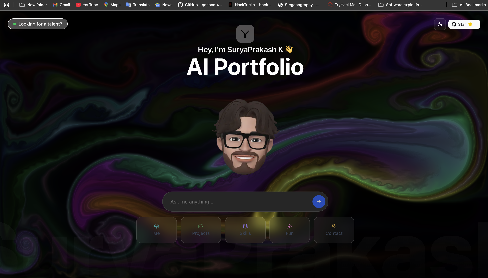

<div align="center">

  <br />
  <p>
    <a href="https://github.com/SuryaPrakash-root/Portfolio"></a>
  </p>
  <br />

  <h1>🔒 AI-Native Cybersecurity Portfolio 🤖✨</h1>
</div>

---

### **Badges**

<p align="center">
  
  
  <a href="https://nextjs.org/"></a>
  <a href="https://vercel.com/"></a>
  <a href="https://mistral.ai/"></a>
  <a href="https://github.com/SuryaPrakash-root/Portfolio/stargazers"></a>
  <a href="https://github.com/SuryaPrakash-root/Portfolio/graphs/contributors"></a>
</p>

---

### **About The Project** 💡

Traditional portfolios are static and one-dimensional. As a **Security Engineer** with 4+ years of experience in cybersecurity and AI/ML, I built this **AI-powered, interactive portfolio** to showcase my expertise in a unique way.

This project transforms the typical portfolio into a **dynamic, conversational experience**. Instead of making recruiters and collaborators scroll through endless text, my AI avatar engages in real-time conversations, answering questions about my security engineering background, projects, and technical expertise.

It's not just a portfolio—it's an intelligent representation of my professional journey in cybersecurity.

---

### **Features** ✨

*   **🗣️ Interactive AI Security Expert:** Engage with an AI that knows my cybersecurity background, from network security to threat detection and AI/ML applications.
*   **🧠 Context-Aware Responses:** The AI adapts its responses based on whether you're a recruiter, security professional, or fellow developer.
*   **🔒 Security-Focused:** Showcases 4+ years of hands-on experience with Fortigate, Sophos, Cisco, Aruba, and security automation.
*   **🎨 Modern UI/UX:** Built with Next.js, TailwindCSS, and Framer Motion for a sleek, responsive experience.
*   **🚀 Real Projects:** Features actual projects from my LinkedIn, including IoT security, AI/ML applications, and fraud detection systems.
*   **💬 Interactive Experience:** Ask about my security tools, threat detection experience, or AI/ML projects—get instant, personalized answers.

---

### **Tech Stack** 🛠️

| **Category**      | **Technology**                                                                                                        |
| ----------------- | --------------------------------------------------------------------------------------------------------------------- |
| **Frontend**      | [Next.js](https://nextjs.org/), [React](https://reactjs.org/), [TypeScript](https://www.typescriptlang.org/), [Tailwind CSS](https://tailwindcss.com/), [Framer Motion](https://www.framer.com/motion/) |
| **Backend**       | [Node.js](https://nodejs.org/), Next.js API Routes                                                                     |
| **AI & APIs**     | [Mistral AI](https://mistral.ai/), [GitHub API](https://docs.github.com/en/rest)      |
| **Deployment**    | [Vercel](https://vercel.com/)                                                                                         |
| **Package Manager**| [pnpm](https://pnpm.io/)                                                                                              |

---

### **My Expertise** 🔐

**Security Engineering:**
- Network Security (Fortigate, Sophos, Cisco, Aruba)
- Endpoint Protection & XDR
- Threat Detection & Analysis
- Malware Analysis
- Python Security Automation
- Linux System Hardening

**AI/ML for Cybersecurity:**
- Machine Learning for Threat Detection
- Anomaly Detection Systems
- Fraud Detection (Transaction Security)
- Deep Learning Applications
- Data Science & Analytics

---

### **Installation & Usage** 🚀

Want to get this project running on your local machine? Follow these simple steps.

#### **Prerequisites**
-   Node.js (v18 or higher)
-   pnpm package manager
-   Mistral API Token

#### **Local Setup**

1.  **Clone the repository:**
    ```sh
    git clone https://github.com/SuryaPrakash-root/Portfolio.git
    cd Portfolio
    ```

2.  **Install dependencies:**
    ```sh
    pnpm install
    ```

3.  **Set up your environment variables:**
    Create a `.env.local` file in the root of your project and add the following:
    ```env
    MISTRAL_API_KEY="your_mistral_api_key_here"
    NODE_ENV="development"
    ```
    *   Get your Mistral API Key from [console.mistral.ai](https://console.mistral.ai/).

4.  **Run the development server:**
    ```sh
    pnpm dev
    ```

5.  **Open your browser** and navigate to `http://localhost:3000`.

---

### **Customization** 🎨

This portfolio is designed to be easily customizable. Update the following files with your information:

- **Personal Info:** `src/components/presentation.tsx`, `src/components/contact.tsx`
- **AI Personality:** `src/app/api/chat/prompt.ts`
- **Projects:** `src/components/projects/Data.tsx`
- **Resume:** `src/components/resume.tsx`
- **Skills:** `src/components/skills.tsx`

See the [customization guide](docs/CUSTOMIZATION.md) for detailed instructions.

---

### **Contributing** 🤝

Contributions are what make the open-source community such an amazing place to learn, inspire, and create. Any contributions you make are **greatly appreciated**.

1.  **Fork** the Project.
2.  Create your Feature Branch (`git checkout -b feature/AmazingFeature`).
3.  Commit your Changes (`git commit -m 'Add some AmazingFeature'`).
4.  Push to the Branch (`git push origin feature/AmazingFeature`).
5.  Open a **Pull Request**.

Please feel free to open an issue if you find a bug or have a feature suggestion.

---

### **Roadmap** 🗺️

-   [x] AI-powered interactive chat
-   [x] LinkedIn project integration
-   [x] Cybersecurity-focused content
-   [x] Responsive design
-   [ ] Add security certifications section
-   [ ] Integrate CTF achievements
-   [ ] Add blog section for security writeups
-   [ ] Implement multilingual support

---

### **License** 📄

This project is open-sourced under the **MIT License**. See the [LICENSE](LICENSE) file for more information.

---

### **Contact & Links** 🔗

**SuryaPrakash K** - Security Engineer | AI/ML for Cybersecurity

<div align="center">

[](https://www.linkedin.com/in/surya-prakash5522/)
&nbsp;
[](https://github.com/SuryaPrakash-root)
&nbsp;
[](mailto:Suryaprakash@zohomail.in)

</div>

---

### **Acknowledgments** 🙏

- Original template inspiration from the AI-native portfolio concept
- Built with modern web technologies and AI integration
- Designed for security professionals and tech recruiters

---

### **Tags**

`#AIPortfolio` `#Cybersecurity` `#SecurityEngineering` `#NextJS` `#React` `#AI` `#MachineLearning` `#NetworkSecurity` `#ThreatDetection` `#Portfolio` `#Vercel` `#MistralAI` `#WebDevelopment` `#InteractiveUI` `#InfoSec`
